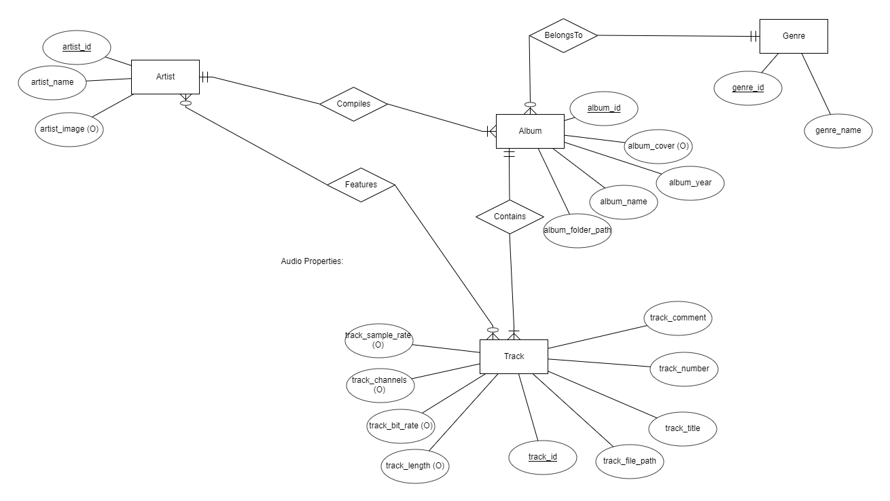

# AMP

Async Music Player - simple server for playing music on a device, controlled using client applications.

# API
The server uses JSON-RPC 2.0 as the API protocol - sending JSON requests and getting the results back. More on JSON-RPC 2.0: https://www.jsonrpc.org/specification

# Methods
RPC methods are implemented as ```amp::Method``` classes and are located in the amp/methods directory. ```Calc``` method doesn't do anything but was used for testing the server connection and functionality. Will be deleted in future. Documentation will be provided later for all the methods (expected input, returned output etc).

# Clients
In the ```clients/``` directory there are a few client examples:

- ampcli - planned for implementation, .NET Core CLI client for the server
- AMP-App - UWP WinUI 3.0 client - currently in development

Android app is also planned for addition.

# Dependencies

Project uses [vcpkg](https://github.com/microsoft/vcpkg) as the library manager. Libraries needed to build the project are:

- [libuv](https://github.com/libuv/libuv) - async server implementation
- [nlohmann/json](https://github.com/nlohmann/json) - C++ json library
- [taglib/taglib](https://github.com/taglib/taglib) - may be replaced later, used for audio metadata reading
- [FFmpeg/FFmpeg](https://github.com/FFmpeg/FFmpeg) - used for reading and decoding audio / video files
- [jtv/libpqxx](https://github.com/jtv/libpqxx) - C++ postgresql client library
- [mackron/miniaudio](https://github.com/mackron/miniaudio) - used for audio playback

As for the system requirements, there should exist a postgresql server which can be used for the database. The server uses the ```AMP``` database and the user named ```amp_admin``` with the same password.

# Database design

Database uses the following ER model:


ER model is open to changes (for example adding more metadata for the track, more artist data, more tables and relationships etc). The server is built with a plan that each of the database fields can be retrieved through some JSON-RPC method.
